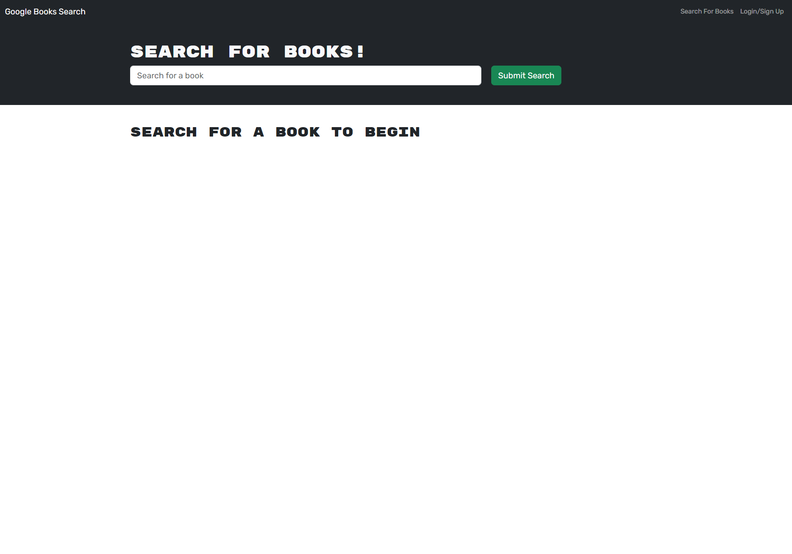

# Book-Search-Engine

### Refactoring A Google Books API search engine built with RESTful API into a  GraphQL API built with Apollo Server

## Table of Contents
1. [Acceptance Criteria](#acceptance-criteria)
2. [Work Completed](#work-completed)
3. [Work To Be Completed](#work-to-be-completed)
4. [Deployed Application URL](#deployed-application-url)
5. [Deployed Application Video Walkthrough](#deployed-application-video-walkthrough)
6. [Deployed Application Screenshots](#deployed-application-screenshots)
7. [Credits](#credits)

## Acceptance Criteria
GIVEN a book search engine, WHEN I load the search engine, THEN I am presented with a menu with the options Search for Books and Login/Signup and an input field to search for books and a submit button
- WHEN I click on the Search for Books menu option THEN I am presented with an input field to search for books and a submit button
- WHEN I am not logged in and enter a search term in the input field and click the submit button THEN I am presented with several search results, each featuring a book’s title, author, description, image, and a link to that book on the Google Books site
- WHEN I click on the Login/Signup menu option THEN a modal appears on the screen with a toggle between the option to log in or sign up
- WHEN the toggle is set to Signup THEN I am presented with three inputs for a username, an email address, and a password, and a signup button
- WHEN the toggle is set to Login THEN I am presented with two inputs for an email address and a password and login button
- WHEN I enter a valid email address and create a password and click on the signup button THEN my user account is created and I am logged in to the site
- WHEN I enter my account’s email address and password and click on the login button THEN I the modal closes and I am logged in to the site
- WHEN I am logged in to the site THEN the menu options change to Search for Books, an option to see my saved books, and Logout
- WHEN I am logged in and enter a search term in the input field and click the submit button THEN I am presented with several search results, each featuring a book’s title, author, description, image, and a link to that book on the Google Books site and a button to save a book to my account
- WHEN I click on the Save button on a book THEN that book’s information is saved to my account
- WHEN I click on the option to see my saved books THEN I am presented with all of the books I have saved to my account, each featuring the book’s title, author, description, image, and a link to that book on the Google Books site and a button to remove a book from my account
- WHEN I click on the Remove button on a book THEN that book is deleted from my saved books list
- WHEN I click on the Logout button THEN I am logged out of the site and presented with a menu with the options Search for Books and Login/Signup and an input field to search for books and a submit button

## Work Completed
- 

## Work To Be Completed

## Deployed Application URL
https://sb-book-search-engine-14b9ffc6092f.herokuapp.com/

## Deployed Application Video Walkthrough
https://drive.google.com/file/d/1tKRhSDX_sbxeNIFf7EDFm4ZSuWejmSLi/view

## Deployed Application Screenshots

.png>)

## Credits

